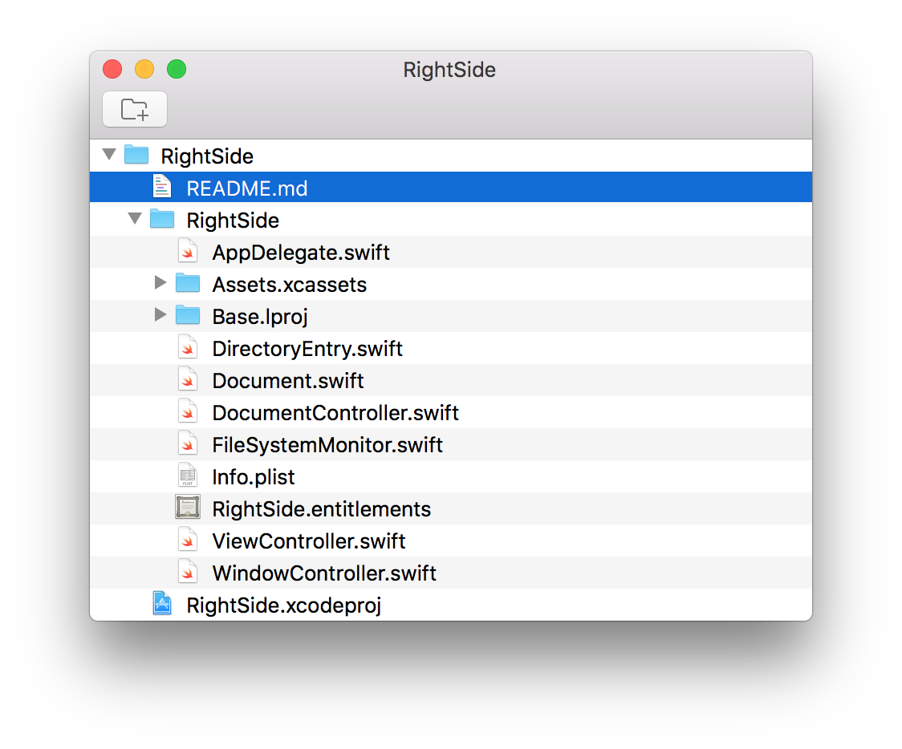

# RightSide

RightSide is a sidebar for any macOS application.

## Feature

- Add / remove reference to directories
- Show multiple directories' contents
- Drag & drop items' reference to other applications
- QuickLook selected items with spacebar
- Open items in Finder or default application from context menu

## TODO

- Window (position, contents) restoration
- Add references by dropping folders
- Toggle QuickLook from main menu
- Application Icon
- QuickLook items with force click
